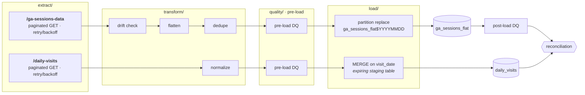

# GA Exploration: API to BigQuery ETL

ETL pipeline for the assessment API: extracts `/daily-visits` (flat) and
`/ga-sessions-data` (nested), flattens sessions, and loads both into
partitioned, clustered BigQuery tables — idempotently, with retries, explicit
data-quality gates, and secrets kept strictly in environment variables.



Both loads are idempotent, so any date can be rerun. `--dry-run` stops after
the pre-load checks and writes JSONL to `artifacts/samples/` instead of
loading. Details in [`docs/02-pipeline-design.md`](docs/02-pipeline-design.md).

## Quickstart

```bash
./scripts/setup.sh                  # idempotent bootstrap: uv sync, .env, lint + tests
set -a; source .env; set +a         # load your credentials

uv run data_pipeline.py run --start-date 2016-08-01 --end-date 2016-08-07
uv run data_pipeline.py run --start-date 2016-08-01 --end-date 2016-08-01 --dry-run
```

Full setup, secrets policy and test commands: [`docs/00-setup.md`](docs/00-setup.md).

## The five assessment steps

| Step | What | Design doc | Code | Tests |
|---|---|---|---|---|
| 1 | API exploration | [`docs/01-api-exploration.md`](docs/01-api-exploration.md) | `scripts/explore_api.sh`, `scripts/profile_api.py` | — (evidence in `artifacts/reports/`) |
| 2 | The pipeline | [`docs/02-pipeline-design.md`](docs/02-pipeline-design.md) | `data_pipeline.py` → `ga_pipeline/` | `tests/unit/`, `tests/integration/` |
| 3 | Airflow | [`docs/03-airflow.md`](docs/03-airflow.md) | `dags/etl_google_analytics_dag.py` | `tests/dag/` |
| 4 | Docker | [`docs/04-docker.md`](docs/04-docker.md) | `Dockerfile` | — |
| 5 | LLM integration (bonus) | [`docs/05-llm-features.md`](docs/05-llm-features.md) | `ga_pipeline/llm/` | `tests/unit/test_llm_*.py`, `tests/unit/test_nl_sql.py` |

## Repository layout

```
data_pipeline.py            CLI entry point (Step 2 deliverable)
pyproject.toml / uv.lock    uv-managed dependencies; the lock pins exact versions
Dockerfile                  container image (Step 4)

ga_pipeline/                the implementation, grouped by pipeline stage
├── cli.py                  Typer interface
├── pipeline.py             orchestration: the spine
├── config.py               environment-only settings
├── exceptions.py           error taxonomy (transient vs fatal)
├── extract/                assessment API client
├── transform/              raw records -> destination row shapes
├── quality/                pre- and post-load data-quality gates
├── load/                   BigQuery table specs and the loader
├── llm/                    Step 5, optional; behind the `llm` extra
└── sql/                    reference DDL + reconciliation query (packaged)

dags/                       Airflow DAG (Step 3)
docs/                       design docs, one per step
scripts/                    bootstrap and Step 1 exploration probes
tests/                      unit / integration / dag  (see tests/README.md)
artifacts/
├── reports/                committed Step 1 evidence
└── samples/                dry-run JSONL output (gitignored)
```

The package is laid out by **pipeline stage**, so the directory listing doubles
as the architecture diagram. `config` and `exceptions` stay at the top level
because every layer imports them. `ga_pipeline/llm/` maps one-to-one to the
optional `llm` extra and to Step 5 — delete the directory and the core pipeline
still runs.

## Secrets

Everything sensitive comes from environment variables; nothing secret is in git
or in the image. See [`docs/00-setup.md`](docs/00-setup.md#secrets-policy). The
key printed in the assessment PDF should be treated as compromised and rotated.

## Known limitations / next steps

* The schema was validated against live responses (see
  [`docs/01-api-exploration.md`](docs/01-api-exploration.md)); the drift gate
  turns any future contract change into an explicit error rather than silent
  NULLs.
* The API exposes only a truncated `hits_sample`, so no hit-level data is loaded
  (`totals_hits` carries the true count). A hit-level fact table — partitioned
  by date, clustered by session key — is the natural next model if the API ever
  serves complete hits.
* `device_category` is derived from `isMobile` when the API omits it; tablets
  are indistinguishable from phones in that fallback.
* The alerting callback logs a redacted, playbook-based triage message (with an
  LLM narrative when configured) but ships without a delivery channel; wire the
  Slack/PagerDuty webhook in `_notify_failure` for production.
