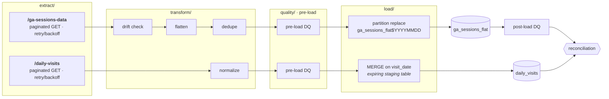

# GA Exploration: API to BigQuery ETL

Pulls `/daily-visits` (flat) and `/ga-sessions-data` (nested) from the analytics
API, flattens sessions, and loads both into partitioned, clustered BigQuery
tables. Loads are idempotent, quality-gated, and configured entirely from
environment variables.



Any date can be rerun. `--dry-run` stops after the pre-load checks and writes
JSONL to `artifacts/samples/` instead of loading.

## Quickstart

```bash
./scripts/setup.sh
set -a; source .env; set +a

uv run data_pipeline.py run --start-date 2016-08-01 --end-date 2016-08-01 --dry-run
uv run data_pipeline.py run --start-date 2016-08-01 --end-date 2016-08-07
```

## Layout

```
data_pipeline.py            CLI entry point
ga_pipeline/                grouped by pipeline stage
├── cli.py                  Typer interface
├── pipeline.py             orchestration
├── config.py               settings, read from the environment
├── exceptions.py           transient vs fatal
├── extract/                API client
├── transform/              API records -> table rows
├── quality/                pre- and post-load checks
├── load/                   table specs and the BigQuery loader
├── llm/                    optional, behind the `llm` extra
└── sql/                    reference DDL and reconciliation query
dags/                       Airflow DAG
scripts/                    bootstrap and API exploration probes
tests/                      unit / integration / dag
artifacts/reports/          API exploration evidence (committed)
artifacts/samples/          dry-run output (gitignored)
```

Stages are directories, so the listing shows the shape of the pipeline.
`config` and `exceptions` sit at the top because every layer imports them.
Deleting `llm/` leaves a working pipeline.

## Docs

| |                                                   |
|---|---------------------------------------------------|
| [setup.md](docs/setup.md) | install, configure, test, run in Docker           |
| [api.md](docs/api.md) | Google analytics API Analysis                     |
| [pipeline.md](docs/pipeline.md) | idempotency, partitioning, quality gates, retries |
| [airflow.md](docs/airflow.md) | schedule, alerting, PII                           |
| [llm.md](docs/llm.md) | optional summary, triage and NL→SQL features      |

## Known gaps

* The API returns a truncated `hits_sample`, so no hit-level data is loaded.
  `totals_hits` carries the real count. A hit-level table would be the next
  model if the API ever serves complete hits.
* `device_category` is derived from `isMobile` when the API omits it, so
  tablets read as phones.
* The failure callback logs a redacted triage message but has no delivery
  channel. Wire a Slack or PagerDuty webhook into `_notify_failure`.
